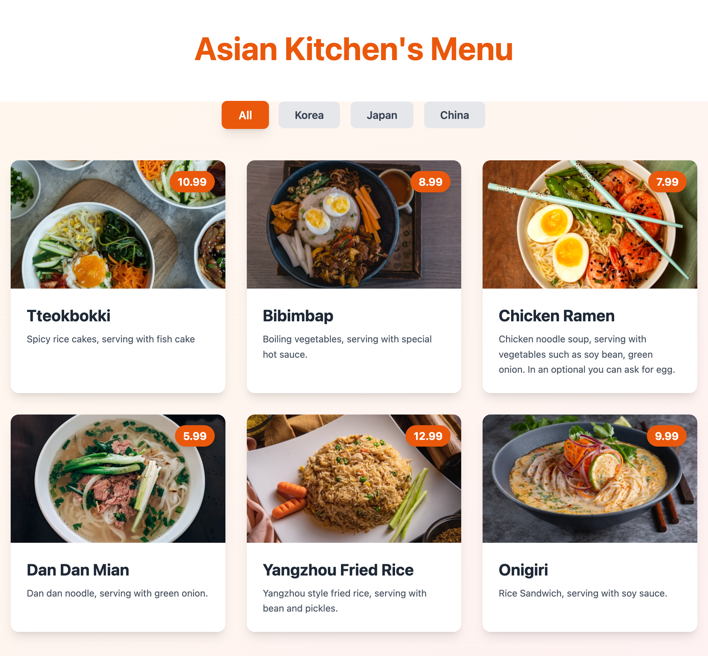

# 🍜 Asian Kitchen's Menu

A modern, responsive restaurant menu application built with React, TypeScript, and Tailwind CSS.

## ✨ Features

- 🎯 Filter menu items by category (Korea, Japan, China)
- 📱 Fully responsive design
- 🎨 Smooth animations and hover effects
- ⚡ Fast performance with custom hooks
- 🎭 Beautiful gradient backgrounds

## 🛠️ Technologies

- **React 18** - UI library
- **TypeScript** - Type safety
- **Tailwind CSS** - Styling
- **Vite** - Build tool

## 📦 Installation

```bash
# Clone the repository
git clone https://github.com/aliefebatuk/Asian_Kitchens_Menu.git

# Navigate to project directory
cd Asian_Kitchens_Menu

# Install dependencies
npm install

# Start development server
npm run dev
```

## 🚀 Usage

1. Open your browser and go to `http://localhost:5173`
2. Click on category buttons to filter menu items
3. Hover over cards to see animations

## 📸 Screenshot



## 📂 Project Structure

```
src/
├── components/     # React components
├── types/          # TypeScript types
├── data/           # Menu data
├── hooks/          # Custom hooks
└── App.tsx         # Main component
```

## 👨‍💻 Author

Ali Efe DENIZ
